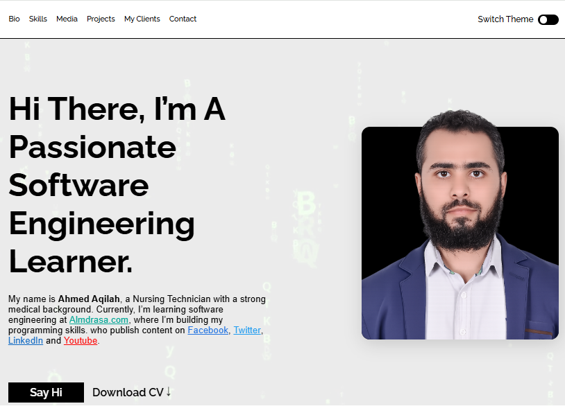

# 🌐 Personal Portfolio Website

Welcome to my personal portfolio website!  
This website showcases my projects, skills, and journey in learning software engineering.

---

## 🚀 About the Project

This is a personal portfolio website designed to present my work in a clean and professional way.  
It includes a collection of my web and Python projects, along with information about me and my skills.

---

## 🧑‍💻 About Me

Hi, I'm **Ahmed Aqilah**  
A Nursing Technician with a strong medical background.
Currently, I’m learning software engineering at [[Almdrasa.com](https://Almdrasa.com)].

---

## 🛠️ Technologies Used

### 🎨 Frontend
- HTML5  
- CSS3  
- SASS (SCSS)

### 📐 Layout Techniques
- Flexbox  
- CSS Grid  

---

## 📂 Features

- Responsive design (works on all devices)  
- Clean and modern UI  
- Projects showcase section  
- About me section  
- Contact / social links  

---

## 📸 Preview

---

## 🔗 Live Demo

👉 [[View Website](https://ahmedaqilah94.github.io/personal-website/)]

---

## 📁 Projects Included

Here are some of the projects featured:

- 💰 Expense Tracker (Python)  
- ❌⭕ Tic Tac Toe Game  
- 🌐 School Website  
- 🧩 Other small web projects  

---

## 📬 Contact Me

Feel free to reach out or connect with me:

-  [Facebook](https://www.facebook.com/share/1axiBoCYPU/)  
-  [LinkedIn](https://www.linkedin.com/in/ahmed-aqilah-9a2b06378/)  
-  [Twitter](https://x.com/aqilah_ahm23084)  
-  [GitHub](https://github.com/ahmedaqilah94)  

---

## 📌 Future Improvements

- Add more advanced projects  
- Improve UI/UX  
- Add animations  
- Connect with backend services  

---

## ⭐ Support

If you like this project, feel free to give it a star ⭐ on GitHub!
